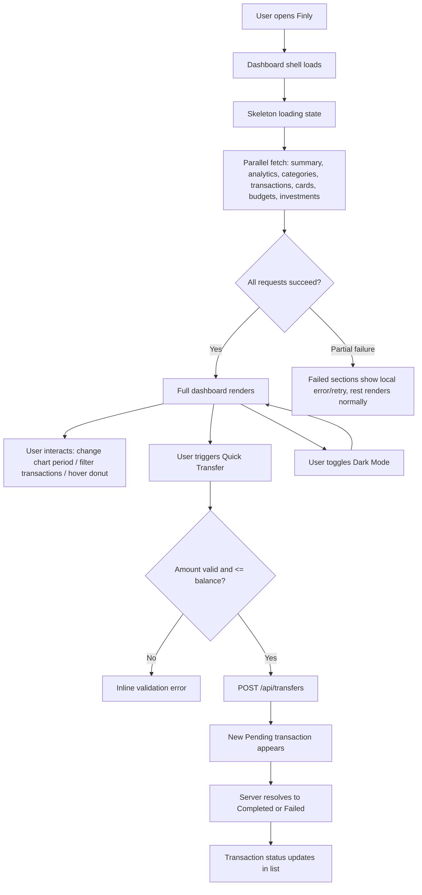
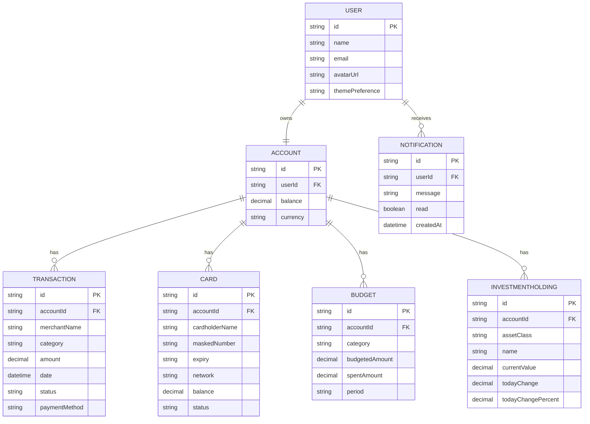
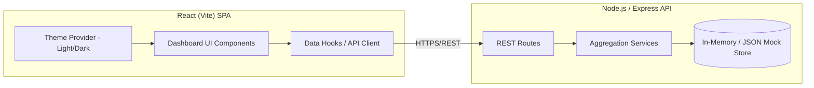

# Finly -- Product Requirements Document

**Version:** 1.0
**Status:** Draft
**Author:** Product Team (via AI-assisted PRD generation)
**Date:** 2026-07-20

---

## 1. Executive Summary

Finly is a single-user personal finance dashboard web application, designed to feel like an official Apple Finance product: minimal, premium, and highly legible. This MVP delivers a fully interactive, visually polished dashboard -- balance overview, income/expense/savings analytics, spending breakdown, transaction history, wallet/card management, budget tracking, investment portfolio, and quick-action money flows -- backed by a lightweight Node.js/Express API serving mock data. No real banking, payment, or authentication integrations are included in this phase; the goal is a production-quality UI/UX shell with a realistic data contract that a later phase can wire to real financial rails without a frontend rewrite.

## 2. Business Context

Finly is being built as a demonstrable, high-fidelity prototype of a personal finance product. It is not yet tied to a live business unit, a paying customer base, or a specific monetization model -- its purpose at this stage is to prove out the product experience (visual design, information architecture, interaction quality) end-to-end on real (if mocked) data flows, so that stakeholders and future engineering phases can evaluate the product before investing in real backend integrations (banking APIs, payment processors, authentication/identity).

**Assumption:** No specific business sponsor, budget, or monetization model was provided. This PRD treats Finly as an internal/portfolio-stage product with a single stakeholder role (the product owner commissioning this build), since no organizational structure was specified.

## 3. Problem Statement

People who want a clear, calm, trustworthy view of their personal finances are often forced into either (a) spreadsheets with no real-time visual feedback, or (b) banking apps that are cluttered, inconsistent in visual quality, and not designed around clarity of information hierarchy. Finly addresses this by giving a single user one dashboard that answers, at a glance: *What do I have? What did I earn and spend? Where did it go? What's coming up?* -- in an interface with Apple-grade visual discipline (whitespace, typography, restrained color, subtle motion) rather than the noisy, inconsistent UI patterns common in fintech products.

## 4. Vision

Finly becomes the reference example of what a personal finance dashboard looks like when visual design is treated as a first-class product requirement rather than an afterthought -- calm, legible, fast, and trustworthy, on any device, in light or dark mode.

## 5. Goals & KPIs

| Goal | KPI | Target (MVP) |
|---|---|---|
| Ship a fully interactive, visually complete dashboard | % of design brief modules implemented | 100% of modules listed in Section 9 |
| Prove the UI holds up across devices | Responsive breakpoints functional without layout breakage | Desktop, laptop, tablet, mobile all pass manual QA |
| Prove the UI holds up across themes | Dark mode parity with light mode | 100% of screens have a working dark variant |
| Establish a clean data contract for future real integrations | API endpoints match real-world equivalents (balances, transactions, cards) in shape | API Contract (Section 22) reviewed and approved before Phase 2 |
| Fast perceived performance on mock data | Initial dashboard render (data loaded) | Under 1.5s on a broadband connection, per Section 11 NFR targets |

**Assumption:** Because this is an MVP/demo, KPIs are framed around build completeness and experience quality rather than business metrics (revenue, retention, activation), since there are no real users yet in this phase.

## 6. Scope

### 6.1 In Scope

- Single-user personal finance dashboard (web, responsive)
- Node.js/Express backend serving realistic mock data (no persistent database; in-memory/JSON-backed data store, reset on server restart)
- Modules: Hero Balance, Stat Cards (Income/Expenses/Savings/Investments), Financial Analytics chart, Spending Categories donut chart, Recent Transactions table, Wallet/Cards panel, Budget Progress, Investment Portfolio, Quick Actions, Quick Transfer widget, top navigation (search, notifications, profile)
- Light mode and full Dark Mode
- Responsive layouts for desktop, laptop, tablet, and mobile
- Client-side interactions: chart period filters (Weekly/Monthly/Yearly), donut chart category hover/legend interaction, transaction status filtering/sorting, "Add New Card" flow (mock, no real card storage), "Send Money" quick action (mock, no real transfer)
- Animated counters, chart transitions, hover/elevation micro-interactions, loading skeleton states

### 6.2 Out of Scope

- Real authentication / login / account creation (single implicit user, no credentials)
- Real bank account linking, Open Banking/Plaid-style integrations, or payment gateway processing
- Multi-user support, roles/permissions beyond the single implicit user
- Persistent database / data survives only for the life of the running mock server process
- Push notifications, email, or SMS delivery (notification bell is UI-only, backed by mock data)
- Regulatory/compliance workstreams (PCI-DSS, SOC 2, data residency) -- explicitly deferred, since no real financial data is processed in this phase
- Native mobile apps (this is a responsive web app only)

## 7. Personas

**Primary Persona -- "The Self-Manager"**
An individual who tracks their own income, spending, savings, and a handful of investments, and wants one screen that shows their financial picture without needing to interpret a spreadsheet. Comfortable with digital products, values visual clarity and speed over configurability. This is the only persona in the MVP, matching the single-user scope decision.

**Secondary Persona -- "The Reviewer" (non-using stakeholder)**
A product/design stakeholder evaluating the build for visual and interaction quality before greenlighting a production phase with real integrations. Does not use the product day-to-day but needs every screen and state (including dark mode and mobile) to be demo-ready.

## 8. User Journey

1. User opens Finly in a browser (no login required for MVP).
2. Dashboard loads: skeleton loading state shows briefly, then Hero Balance, stat cards, chart, and transaction list populate from the mock API.
3. User scans balance, income, savings, expenses at a glance.
4. User switches the Financial Analytics chart between Weekly/Monthly/Yearly to understand trends.
5. User hovers the Spending Categories donut to see category-level breakdown.
6. User scrolls to Recent Transactions, filters by status (Completed/Pending/Failed), and reviews individual transactions.
7. User checks Wallet panel, views card balance/status, and optionally triggers "Add New Card" (mock flow).
8. User uses Quick Transfer to simulate sending money to a recent contact.
9. User checks Budget Progress and Investment Portfolio for a fuller financial picture.
10. User toggles Dark Mode and confirms the same information is legible and consistent.
11. User resizes/opens on mobile and confirms the dashboard reflows into a usable single-column/tab-based layout.

## 9. Feature List

Each feature below follows Epic / User Story / Acceptance Criteria / Business Rules / Validation Rules / Error Scenarios / Edge Cases.

### 9.1 Hero Balance & Stat Cards

- **Epic:** Financial Overview
- **User Story:** As a user, I want to see my total balance, income, savings, and expenses immediately on load, so that I know my financial position at a glance.
- **Acceptance Criteria:**
  - Given the dashboard loads, when data is fetched successfully, then the Hero Balance card displays the current balance with an animated count-up.
  - Given the stat cards render, when income, savings, and expenses values are available, then each renders its value, an icon, and a mini sparkline.
  - Given the user hovers a stat card, when the hover state triggers, then the card elevates (soft shadow + scale 0.98 on press).
- **Business Rules:** Balance = Income - Expenses + prior Savings carryover (computed server-side, not client-side, so the client never re-derives financial totals).
- **Validation Rules:** All monetary values are non-negative except Expenses' net effect; values render with 2 decimal places and the account currency symbol.
- **Error Scenarios:** If the summary endpoint fails, show a non-blocking inline error state on the affected card with a manual "Retry" affordance; other cards continue to render independently.
- **Edge Cases:** Zero balance state (new/empty account); balance turns negative (must render clearly in danger color `#FF453A`, not silently clipped); very large numbers (7+ digits) must not overflow the card layout.

### 9.2 Financial Analytics Chart

- **Epic:** Financial Overview
- **User Story:** As a user, I want to compare income, expenses, and savings over time with selectable periods, so that I can understand my financial trend.
- **Acceptance Criteria:**
  - Given the chart is visible, when the user selects Weekly, Monthly, or Yearly, then the chart re-renders with the corresponding aggregation without a full page reload.
  - Given the user hovers a point on the chart, when the tooltip triggers, then it shows the exact value and date/period for that point.
- **Business Rules:** Default period on load is Monthly. Aggregation buckets: Weekly = last 7 days daily, Monthly = last 30 days daily, Yearly = last 12 months monthly.
- **Validation Rules:** Chart must handle an empty data series (no transactions in range) without throwing -- render an explicit "No data for this period" state.
- **Error Scenarios:** If the analytics endpoint times out, show a skeleton-to-error transition inside the chart container only, not the whole page.
- **Edge Cases:** Single data point (chart must not crash trying to draw a line with one point); values with ties between income and expense lines; switching periods rapidly (must cancel/ignore stale in-flight requests, "request debouncing").

### 9.3 Spending Categories (Donut Chart)

- **Epic:** Spending Insight
- **User Story:** As a user, I want to see my spending broken down by category, so that I know where my money goes.
- **Acceptance Criteria:**
  - Given expense transactions exist, when the donut chart renders, then each category segment is proportional to its share of total expenses, with a legend listing category name and color.
  - Given the user hovers/taps a segment, when the interaction triggers, then that segment highlights and shows its exact amount and percentage.
- **Business Rules:** Categories: Food, Shopping, Bills, Entertainment, Transportation, Healthcare, Investments (per design brief). Any transaction without a matched category falls into an "Other" bucket.
- **Validation Rules:** Percentages across all segments must sum to 100% (rounding handled by adjusting the largest segment, not by silently dropping the remainder).
- **Error Scenarios:** If category data fails to load, render the donut in a neutral "unavailable" gray state rather than a broken chart.
- **Edge Cases:** All spending in a single category (100% one segment); no expenses at all in the period (empty-state donut with a message, not a rendering error).

### 9.4 Recent Transactions

- **Epic:** Transaction History
- **User Story:** As a user, I want to see and filter my recent transactions, so that I can review individual activity.
- **Acceptance Criteria:**
  - Given transactions exist, when the table renders, then each row shows avatar/merchant icon, merchant name, category, date, amount, and status (Completed/Pending/Failed).
  - Given the user selects a status filter or the "Recent" sort dropdown, when applied, then the list updates client-side without a full reload.
- **Business Rules:** Default sort is most recent first. Status colors: Completed = success `#30D158`, Pending = warning `#FF9F0A`, Failed = danger `#FF453A`.
- **Validation Rules:** Amount always renders with a sign-appropriate color/prefix (e.g., outgoing shown in default text color, not necessarily red, per the reference design where amounts aren't universally red/green).
- **Error Scenarios:** Paginated fetch failure on "load more" shows an inline retry row at the bottom of the table without discarding already-loaded rows.
- **Edge Cases:** Merchant name overflow (truncate with ellipsis + full name on hover/tooltip); zero transactions (empty state illustration + copy); a transaction with a Failed status (must be visually distinct and not confused with Pending).

### 9.5 Wallet & Cards

- **Epic:** Wallet Management
- **User Story:** As a user, I want to view my cards and their balances, and add a new card, so that I can manage my payment methods.
- **Acceptance Criteria:**
  - Given the Wallet panel renders, when card data loads, then each card shows a stylized card visual (masked number, expiry, network logo), balance, currency, and status (Active/Inactive).
  - Given the user clicks "Add New Card," when the mock form is submitted with valid input, then a new card appears in the list without a page reload.
- **Business Rules:** Card numbers are always displayed masked (`0818 7183 0713 2514` pattern shown in the reference design is treated as already-masked display data, not raw PAN storage).
- **Validation Rules:** Add Card form requires: cardholder name, card number (13-19 digits, Luhn-checked client-side for UX only, not real payment validation), expiry (MM/YY, must be a future date), network auto-detected from number prefix.
- **Error Scenarios:** Invalid Luhn checksum or expired date blocks submission with an inline field error; mock API failure on save shows a form-level error and preserves entered values.
- **Edge Cases:** User has zero cards (empty state prompting "Add New Card"); maximum of 5 mock cards enforced with a clear message when exceeded.

### 9.6 Budget Progress

- **Epic:** Spending Insight
- **User Story:** As a user, I want to see progress bars for my budget categories, so that I know if I'm on track or overspending.
- **Acceptance Criteria:**
  - Given budgets exist for Food, Shopping, Entertainment, Travel, and Bills, when the panel renders, then each shows an animated progress bar of spent-vs-budgeted amount.
  - Given a category exceeds 100% of budget, when rendered, then the bar switches to the danger color and shows an "over budget" indicator.
- **Business Rules:** Progress = (spent this period / budgeted amount this period) × 100, capped visually at 100% width with an overflow indicator beyond that.
- **Validation Rules:** Budgeted amounts must be positive numbers; a budget of 0 is treated as "no budget set" (renders as an empty/dashed bar, not a divide-by-zero state).
- **Error Scenarios:** Missing budget data for a category renders that category as "not budgeted" rather than omitting the row silently.
- **Edge Cases:** Spent = 0 (0% bar, not hidden); category with no transactions this period at all.

### 9.7 Investment Portfolio

- **Epic:** Financial Overview
- **User Story:** As a user, I want to see my investment holdings and today's performance, so that I understand my broader financial position.
- **Acceptance Criteria:**
  - Given holdings exist across Stocks, Crypto, ETF, and Mutual Funds, when the panel renders, then it shows total portfolio value, today's profit/loss (value and %), and an asset allocation chart.
  - Given profit/loss is positive or negative, when rendered, then the value/color reflects gain (success) or loss (danger) accordingly.
- **Business Rules:** Total Portfolio Value = sum of all holdings' current mock market value; Today's P/L = value change since the previous mock daily snapshot.
- **Validation Rules:** Allocation percentages must sum to 100% across asset classes.
- **Error Scenarios:** If a single asset class fails to load, the rest of the portfolio still renders with that class marked "unavailable."
- **Edge Cases:** Empty portfolio (no holdings) shows an empty state with a prompt rather than a zeroed/broken chart; a single asset class holding 100% of the portfolio.

### 9.8 Quick Actions & Quick Transfer

- **Epic:** Money Movement (Mocked)
- **User Story:** As a user, I want quick-action buttons (Send Money, Request Money, Transfer, Pay Bills, Top Up, Add Card) and a Quick Transfer widget, so that common actions are one click away.
- **Acceptance Criteria:**
  - Given the user selects a recent contact and enters a card number/amount in Quick Transfer, when "Send Money" is clicked with valid input, then a mock success confirmation displays and a new "Pending" transaction appears in Recent Transactions.
  - Given "Save as Draft" is clicked, when triggered, then the entered transfer data is retained locally (client-side) for the session without being submitted.
- **Business Rules:** All money-movement actions in the MVP are simulated: no real funds move, and the mock backend does not integrate with any payment rail.
- **Validation Rules:** Transfer amount must be greater than 0 and not exceed the current mock balance (client + server-side check); card number field must pass basic format validation.
- **Error Scenarios:** Attempting to send more than the available balance is rejected with a clear inline error before submission; simulated network failure shows a retry option without double-submitting.
- **Edge Cases:** Rapid double-click on "Send Money" (must not create two transactions); sending to a contact not in the recent list (should still be allowed via manual card number entry).

### 9.9 Global Shell: Navigation, Search, Notifications, Dark Mode

- **Epic:** Platform Shell
- **User Story:** As a user, I want a persistent sidebar, top search, notifications, and a theme switcher, so that I can navigate and control the app consistently from any screen.
- **Acceptance Criteria:**
  - Given the app is loaded, when any dashboard section is viewed, then the frosted-glass sidebar and top nav remain visible and functional.
  - Given the user types in the search bar, when input is provided, then matching transactions/items filter or surface as suggestions.
  - Given the user toggles the theme switcher, when triggered, then the entire UI transitions to Dark Mode using the palette in Section 15, and the preference persists for the session.
- **Business Rules:** Sidebar items beyond "Dashboard" (Wallet, Cards, Transactions, Analytics, Investments, Budgets, Reports, Settings) are present as navigation targets; in this MVP phase, only Dashboard is a fully built page, and the others render a "Coming in a future phase" placeholder screen rather than a broken route.
- **Validation Rules:** Search input is sanitized/trimmed; empty search shows the default (unfiltered) state.
- **Error Scenarios:** Notification data fetch failure shows an empty bell state rather than blocking the shell from rendering.
- **Edge Cases:** Very long search queries; theme toggle mid-animation (must not visually tear); notification badge count above 99 (renders as "99+").

## 10. Functional Requirements

Format per module: Description, Actors, Precondition, Postcondition, Workflow, API Dependencies, Permission, Success Response, Failure Response.

### 10.1 Module: Account Summary (Hero Balance + Stat Cards)
- **Description:** Retrieves and displays the user's aggregate financial summary.
- **Actors:** User (default single user)
- **Precondition:** Mock backend is running and seeded with account data.
- **Postcondition:** Balance, income, savings, and expenses are visible on screen.
- **Workflow:** 1) Client requests `/api/accounts/summary` on dashboard mount. 2) Server computes/returns aggregate values. 3) Client renders Hero Balance + 4 stat cards with animated counters. 4) Client requests sparkline data per stat card.
- **API Dependencies:** `GET /api/accounts/summary`, `GET /api/accounts/sparkline/:metric`
- **Permission:** User (default, unauthenticated MVP context)
- **Success Response:** `200 OK` with summary JSON payload (see Section 22).
- **Failure Response:** `500` triggers inline retry on the affected card; `404` (no account) triggers the empty-state view.

### 10.2 Module: Financial Analytics
- **Description:** Provides time-series income/expense/savings data for the analytics chart.
- **Actors:** User
- **Precondition:** Account summary has loaded.
- **Postcondition:** Chart displays the selected period's series with working hover tooltips.
- **Workflow:** 1) Client requests `/api/analytics?period=monthly` (default). 2) User changes period via dropdown. 3) Client re-requests with new `period` param, cancelling any in-flight prior request. 4) Chart re-renders with transition animation.
- **API Dependencies:** `GET /api/analytics?period={weekly|monthly|yearly}`
- **Permission:** User
- **Success Response:** `200 OK` with an array of `{date, income, expenses, savings}` points.
- **Failure Response:** `500`/timeout shows chart-local error state; malformed `period` param returns `400` with a validation message, client falls back to `monthly`.

### 10.3 Module: Spending Categories
- **Description:** Provides category-aggregated expense data for the donut chart.
- **Actors:** User
- **Precondition:** Transactions exist for the current period.
- **Postcondition:** Donut chart and legend reflect category breakdown.
- **Workflow:** 1) Client requests `/api/analytics/categories?period=monthly`. 2) Server aggregates expense transactions by category. 3) Client renders donut + legend + daily/weekly/monthly totals.
- **API Dependencies:** `GET /api/analytics/categories`
- **Permission:** User
- **Success Response:** `200 OK` with `{categories: [{name, amount, percentage, color}], totals: {daily, weekly, monthly}}`.
- **Failure Response:** `500` renders neutral/unavailable donut state.

### 10.4 Module: Transactions
- **Description:** Lists, filters, and paginates transaction history.
- **Actors:** User
- **Precondition:** None (empty state supported).
- **Postcondition:** User can view, filter by status, and sort transactions.
- **Workflow:** 1) Client requests `/api/transactions?sort=recent&page=1`. 2) User applies a status filter. 3) Client re-requests with `status` query param. 4) User scrolls/clicks "load more," client requests next page and appends.
- **API Dependencies:** `GET /api/transactions`
- **Permission:** User
- **Success Response:** `200 OK` with `{items: [...], page, totalPages}`.
- **Failure Response:** `500` on pagination shows inline retry row; initial load failure shows full-section error state.

### 10.5 Module: Wallet & Cards
- **Description:** Manages the mock list of the user's cards.
- **Actors:** User
- **Precondition:** None (empty state supported).
- **Postcondition:** Cards list reflects any additions in real time.
- **Workflow:** 1) Client requests `/api/cards` on Wallet panel mount. 2) User submits Add Card form. 3) Client validates client-side, then `POST /api/cards`. 4) Server validates and stores in mock store, returns created card. 5) Client appends new card to list.
- **API Dependencies:** `GET /api/cards`, `POST /api/cards`
- **Permission:** User
- **Success Response:** `200 OK` (list) / `201 Created` (new card).
- **Failure Response:** `422` on validation error returns field-level messages; client renders them inline on the form.

### 10.6 Module: Budgets
- **Description:** Retrieves budget-vs-spend data per category.
- **Actors:** User
- **Precondition:** Budgets are seeded in mock data.
- **Postcondition:** Progress bars reflect current spend against budget.
- **Workflow:** 1) Client requests `/api/budgets`. 2) Server returns per-category budgeted and spent amounts. 3) Client renders animated progress bars.
- **API Dependencies:** `GET /api/budgets`
- **Permission:** User
- **Success Response:** `200 OK` with `{categories: [{name, budgeted, spent}]}`.
- **Failure Response:** `500` shows a static (non-animated) fallback row per category with "unavailable" label.

### 10.7 Module: Investment Portfolio
- **Description:** Retrieves holdings and today's performance across asset classes.
- **Actors:** User
- **Precondition:** Portfolio is seeded in mock data.
- **Postcondition:** Portfolio value, P/L, and allocation chart render.
- **Workflow:** 1) Client requests `/api/investments`. 2) Server returns holdings grouped by asset class with today's snapshot delta. 3) Client renders summary + allocation chart.
- **API Dependencies:** `GET /api/investments`
- **Permission:** User
- **Success Response:** `200 OK` with `{totalValue, todayChange, todayChangePercent, allocations: [...]}`.
- **Failure Response:** `500` shows portfolio empty/error state, does not block rest of dashboard.

### 10.8 Module: Quick Transfer (Mock Money Movement)
- **Description:** Simulates sending money to a contact/card.
- **Actors:** User
- **Precondition:** User has a positive mock balance.
- **Postcondition:** A new Pending transaction is created and balance is optimistically adjusted.
- **Workflow:** 1) User selects a recent contact or enters a card number, enters amount. 2) Client validates amount ≤ balance. 3) Client `POST /api/transfers`. 4) Server validates, deducts mock balance, creates a Pending transaction, and (after a simulated delay) marks it Completed or Failed. 5) Client shows confirmation and updates Recent Transactions.
- **API Dependencies:** `POST /api/transfers`
- **Permission:** User
- **Success Response:** `201 Created` with the created (Pending) transaction object.
- **Failure Response:** `422` for insufficient balance / invalid input, returned with a field-level message; `500` shows a generic retry-safe error (no funds are deducted on failure).

### 10.9 Module: Notifications & Search (Shell)
- **Description:** Provides mock notification list and client-side search across transactions/cards.
- **Actors:** User
- **Precondition:** Dashboard shell is mounted.
- **Postcondition:** Notification bell shows unread count; search returns matching items.
- **Workflow:** 1) Client requests `/api/notifications` on shell mount. 2) User types in search bar. 3) Client filters already-loaded transactions/cards client-side (no server round-trip for MVP search).
- **API Dependencies:** `GET /api/notifications`
- **Permission:** User
- **Success Response:** `200 OK` with `{items: [...], unreadCount}`.
- **Failure Response:** `500` shows an empty bell (0 badge), does not block shell.

## 11. Non-Functional Requirements

| Category | Requirement |
|---|---|
| Performance | Initial dashboard data-loaded render under 1.5s on broadband; chart period switch re-render under 300ms. **Assumption:** target set per enterprise-default since no target was specified. |
| Security | No real financial credentials are ever collected/stored in the MVP; all inputs are sanitized server-side even though data is mock, to keep the API contract production-shaped. |
| Availability | MVP target 99% uptime during demo/review windows (single-instance, no HA requirement at this stage). **Assumption**, since this is a non-production demo. |
| Accessibility | WCAG 2.1 AA color contrast for all text/background combinations in both themes; all interactive elements keyboard-navigable; charts have text-equivalent summaries for screen readers. |
| Scalability | Not a requirement for MVP (single mock user, in-memory store); architecture should not preclude adding a real database later (see Section 23). |
| Maintainability | Component-based React architecture with clear separation of UI components, data-fetching hooks, and mock API layer, so the mock backend can be swapped for a real one without frontend rewrites. |
| Logging | All API requests logged server-side with method, path, status code, and response time (console/stdout logging is sufficient for MVP; see Section 25). |
| Monitoring | Basic health-check endpoint (`GET /api/health`) for uptime checks during demo hosting. |
| Backup | Not applicable -- no persistent data store in MVP. |
| Recovery | Mock data reseeds automatically on server restart; no recovery procedure needed beyond restart. |
| Localization | English-only UI for MVP. **Assumption**, based on documentation language selection; no localization framework required yet but text should not be hardcoded inline where avoidable, to ease future i18n. |
| SEO | Not applicable -- authenticated-style personal dashboard, not a public/indexable surface. |

## 12. Business Rules

1. All monetary aggregates (balance, totals, portfolio value) are computed server-side; the client never independently derives a financial total from raw transaction data.
2. A transaction's status lifecycle is one-directional for the MVP: Pending → Completed or Pending → Failed. A transaction never moves backward from a terminal state.
3. Budgets are evaluated against the current calendar month by default.
4. Card numbers are always transmitted and displayed in masked form; the mock backend never returns a full unmasked number in any API response.
5. Quick Transfer cannot be submitted for an amount exceeding the current mock balance.
6. Only "Dashboard" is a fully implemented page in this MVP; all other sidebar destinations render a clearly labeled placeholder rather than a broken link or fabricated data.

## 13. Validation Rules

| Field | Rule |
|---|---|
| Transfer amount | Numeric, > 0, ≤ current balance, max 2 decimal places |
| Card number | 13-19 digits, passes Luhn check (client-side UX validation only) |
| Card expiry | MM/YY format, must be a future date |
| Cardholder name | 2-60 characters, letters/spaces/hyphens only |
| Search input | Trimmed, max 100 characters, no script/HTML injection (sanitized) |
| Budget amount | Numeric, ≥ 0 |
| Period filter (`period` query param) | One of `weekly`, `monthly`, `yearly`; invalid values rejected with `400` |
| Transaction status filter | One of `completed`, `pending`, `failed`, or unset (all) |

## 14. UX Requirements

- Information hierarchy prioritizes balance and cash-flow trend above all other content on first viewport.
- Every async section (cards, chart, table) has its own independent loading skeleton and error state -- a failure in one section never blocks or breaks another.
- All numeric transitions (balance counter, chart values) animate rather than snapping, but respect `prefers-reduced-motion`.
- Every primary action (Send Money, Add Card) has a clear success confirmation and a clear, specific failure message -- never a silent failure.
- Touch targets on mobile are a minimum 44x44px per Apple HIG guidance.

## 15. UI Requirements

Design tokens carried directly from the provided design brief:

**Light Mode**
| Token | Value |
|---|---|
| Primary (Apple Blue) | `#007AFF` |
| Background | `#F5F5F7` |
| Surface/Card | `#FFFFFF` |
| Text Primary | `#1D1D1F` |
| Text Secondary | `#6E6E73` |
| Success | `#30D158` |
| Warning | `#FF9F0A` |
| Danger | `#FF453A` |
| Card border | `#E5E5E7` (thin) |
| Card shadow | `0 10px 30px rgba(0,0,0,0.05)` |

**Dark Mode**
| Token | Value |
|---|---|
| Background | `#000000` |
| Surface | `#1C1C1E` |
| Card | `#2C2C2E` |
| Primary | `#0A84FF` |
| Text Primary | `#FFFFFF` |
| Text Secondary | `#8E8E93` |

**Typography:** SF Pro Display (headings) / SF Pro Text (body), with a system-font-stack fallback (`-apple-system, BlinkMacSystemFont, "Segoe UI", Roboto, sans-serif`) for non-Apple platforms.

**Component Radius:** 20-24px on all cards; thin 1px borders using the border token above; no heavy gradients, no drop shadows beyond the specified soft shadow.

**Iconography:** Line-style icon set consistent with Apple SF Symbols visual weight (implementation may use `lucide-react` as a close open-source equivalent).

**Motion:** Fade-in on mount, scale-to-0.98 on press/hover for interactive cards and buttons, smooth chart transitions, skeleton loading shimmer.

## 16. Information Architecture

```
Finly
├── Dashboard (fully implemented in MVP)
│   ├── Hero Balance + Stat Cards
│   ├── Financial Analytics Chart
│   ├── Spending Categories Donut
│   ├── Recent Transactions
│   ├── Wallet / My Cards
│   ├── Budget Progress
│   ├── Investment Portfolio
│   └── Quick Actions / Quick Transfer
├── Wallet (placeholder in MVP)
├── Cards (placeholder in MVP)
├── Transactions (placeholder in MVP, full history beyond "recent")
├── Analytics (placeholder in MVP)
├── Investments (placeholder in MVP)
├── Budgets (placeholder in MVP)
├── Reports (placeholder in MVP)
└── Settings (placeholder in MVP, incl. theme preference)
```

## 17. Sitemap

| Route | Page | MVP Status |
|---|---|---|
| `/` | Dashboard | Fully implemented |
| `/wallet` | Wallet | Placeholder |
| `/cards` | Cards | Placeholder |
| `/transactions` | Transactions (full history) | Placeholder |
| `/analytics` | Analytics | Placeholder |
| `/investments` | Investments | Placeholder |
| `/budgets` | Budgets | Placeholder |
| `/reports` | Reports | Placeholder |
| `/settings` | Settings | Placeholder |

## 18. User Flow



## 19. Wireframe Notes

The provided reference screenshot is the authoritative low-fidelity wireframe for the Dashboard page layout: left icon sidebar (collapsed/icon-only), top bar with search + notifications + profile, a 4-column stat row (1 large "Balance" hero cell + 3 standard cells), a 2-column analytics row (line chart ~65% width, donut chart ~35% width), a right-hand column persisting across the page for Wallet/My Cards + Quick Transfer, and a full-width Recent Transactions table beneath the analytics row. Mobile/tablet breakpoints should collapse the right-hand column below the main content and convert the sidebar to a bottom tab bar or slide-out drawer (**Assumption**, since only desktop wireframe was provided -- responsive behavior below desktop is inferred from Apple HIG mobile navigation conventions).

## 20. Data Model

```
User
- id (string, PK)
- name (string)
- email (string)
- avatarUrl (string)
- themePreference (enum: light | dark)

Account
- id (string, PK)
- userId (FK -> User.id)
- balance (decimal)
- currency (string, e.g. "USD")

Transaction
- id (string, PK)
- accountId (FK -> Account.id)
- merchantName (string)
- category (enum: Food | Shopping | Bills | Entertainment | Transportation | Healthcare | Investments | Other)
- amount (decimal)
- date (datetime)
- status (enum: Completed | Pending | Failed)
- paymentMethod (string)

Card
- id (string, PK)
- accountId (FK -> Account.id)
- cardholderName (string)
- maskedNumber (string)
- expiry (string, MM/YY)
- network (enum: Visa | Mastercard | Other)
- balance (decimal)
- status (enum: Active | Inactive)

Budget
- id (string, PK)
- accountId (FK -> Account.id)
- category (enum: Food | Shopping | Entertainment | Travel | Bills)
- budgetedAmount (decimal)
- spentAmount (decimal)
- period (string, e.g. "2026-07")

InvestmentHolding
- id (string, PK)
- accountId (FK -> Account.id)
- assetClass (enum: Stock | Crypto | ETF | MutualFund)
- name (string)
- currentValue (decimal)
- todayChange (decimal)
- todayChangePercent (decimal)

Notification
- id (string, PK)
- userId (FK -> User.id)
- message (string)
- read (boolean)
- createdAt (datetime)
```

**Assumption:** This schema is designed relationally (ready for PostgreSQL) even though the MVP uses an in-memory/JSON store, so Phase 2 (real backend) can adopt it directly without redesign.

## 21. ERD



## 22. API Contract

All endpoints are prefixed `/api`. No authentication header is required in the MVP (**Assumption**, per the "no real auth" scope decision); the API is structured so a `Authorization: Bearer <token>` requirement can be added later without changing payload shapes.

| Method | Path | Request | Success Response | Error Codes |
|---|---|---|---|---|
| GET | `/health` | -- | `200 { status: "ok" }` | -- |
| GET | `/accounts/summary` | -- | `200 { balance, income, expenses, savings, currency }` | `404`, `500` |
| GET | `/accounts/sparkline/:metric` | `metric` = income\|expenses\|savings | `200 { points: [{date, value}] }` | `400`, `500` |
| GET | `/analytics` | query: `period` (weekly\|monthly\|yearly) | `200 { period, series: [{date, income, expenses, savings}] }` | `400`, `500` |
| GET | `/analytics/categories` | query: `period` | `200 { categories: [{name, amount, percentage, color}], totals: {daily, weekly, monthly} }` | `400`, `500` |
| GET | `/transactions` | query: `status`, `sort`, `page` | `200 { items: [...], page, totalPages }` | `400`, `500` |
| GET | `/cards` | -- | `200 { items: [Card] }` | `500` |
| POST | `/cards` | `{ cardholderName, cardNumber, expiry }` | `201 { card: Card }` | `422`, `500` |
| GET | `/budgets` | -- | `200 { categories: [{name, budgeted, spent}] }` | `500` |
| GET | `/investments` | -- | `200 { totalValue, todayChange, todayChangePercent, allocations: [...] }` | `500` |
| POST | `/transfers` | `{ recipientCardNumber, amount, note? }` | `201 { transaction: Transaction }` | `422`, `500` |
| GET | `/notifications` | -- | `200 { items: [Notification], unreadCount }` | `500` |

## 23. Architecture



**System Architecture:** Single-page React application (built with Vite) communicating over REST/JSON with a single Node.js/Express service. No message queue, no microservices, no external dependencies beyond the mock data store -- appropriate for the MVP's single-user, non-persistent scope. **Assumption:** monolithic architecture chosen since no multi-service or high-scale requirement was given.

**Folder Structure (suggested):**
```
finly/
├── client/
│   ├── src/
│   │   ├── components/       # Card, Chart, DonutChart, TransactionRow, etc.
│   │   ├── pages/             # Dashboard, placeholders for other routes
│   │   ├── hooks/             # useAccountSummary, useAnalytics, useTransactions, etc.
│   │   ├── api/                # fetch client wrapper
│   │   ├── theme/             # light/dark tokens, ThemeProvider
│   │   └── App.tsx
│   └── vite.config.ts
└── server/
    ├── src/
    │   ├── routes/            # accounts, analytics, transactions, cards, budgets, investments, transfers, notifications
    │   ├── services/          # aggregation/business logic
    │   ├── data/               # mock seed JSON
    │   └── app.ts
    └── package.json
```

**Module Dependency:** `pages` depend on `hooks`, `hooks` depend on `api` client, `api` client depends on `server routes`; `routes` depend on `services`, `services` depend on `data` store. No circular dependencies.

**Environment Variables:**
```
# server/.env
PORT=4000
NODE_ENV=development
CORS_ORIGIN=http://localhost:5173

# client/.env
VITE_API_BASE_URL=http://localhost:4000/api
```

**CI/CD Recommendation:** GitHub Actions pipeline running lint + type-check + build on every PR for both `client` and `server`; deploy previews on PR (e.g., Vercel preview for client). **Assumption**, since no CI/CD preference was specified.

**Deployment Strategy:** Frontend deployed as a static build to Vercel; backend deployed as a small Node service to Railway or Render. **Assumption**, flagged during Step 3 confirmation as a placeholder target -- easy to change since the app has no infrastructure lock-in.

## 24. Security

- No real PII or financial credentials are collected in the MVP; all seed/mock data is synthetic.
- Card numbers are never returned unmasked by the API, even though they are mock, to keep the contract identical to what a real implementation would require.
- All API inputs (transfer amount, card form fields, search) are validated and sanitized server-side, not just client-side, to prevent injection even against mock endpoints.
- CORS is restricted to the known client origin (see Environment Variables above).
- **RBAC:** Out of scope for MVP -- single implicit user, no roles. Flagged explicitly per Step 1 discovery (single-user decision).
- **Audit trail:** Out of scope for MVP -- no persistent store to audit against.
- **Approval workflows:** Out of scope -- no multi-party transactions in this phase.
- **Encryption:** Out of scope for data at rest (no persistent store); HTTPS assumed in any hosted deployment for encryption in transit. **Assumption**, standard practice, not explicitly requested.
- **Compliance:** No compliance regime applies, since no real financial data is processed in the MVP; to be revisited if Phase 2 introduces real banking/payment integrations (would likely trigger PCI-DSS scope).

## 25. Logging

- Server logs every request: timestamp, method, path, status code, response time (structured console output, e.g. via a lightweight middleware like `morgan`).
- Client logs API errors to the browser console in development; no client-side error reporting service is wired up in MVP (**Assumption:** deferred to Phase 2 alongside real error-monitoring needs).

## 26. Monitoring

- `GET /api/health` endpoint for uptime checks by the hosting platform.
- **Assumption:** No APM/observability tool (e.g. Datadog, Sentry) is included in MVP scope, since this is a demo-stage build; recommended for Phase 2 once real users/data are involved.

## 27. QA Strategy

**Test Strategy:** Manual QA across all breakpoints (desktop, laptop, tablet, mobile) and both themes (light/dark) for every module in Section 9, supplemented by component-level unit tests for data-transformation logic (chart aggregation, budget percentage calculation, donut percentage rounding) and integration tests for the mock API routes.

**Test Cases (representative):**
| ID | Tied to AC | Case | Expected Result |
|---|---|---|---|
| TC-01 | 9.1 | Load dashboard with valid data | Balance/income/savings/expenses render with animated counters |
| TC-02 | 9.2 | Switch chart period to Yearly | Chart re-renders with 12 monthly points, no stale data |
| TC-03 | 9.3 | Hover donut segment | Segment highlights, shows exact amount/percentage |
| TC-04 | 9.4 | Filter transactions by "Failed" | Only Failed-status rows shown |
| TC-05 | 9.5 | Add card with expired date | Submission blocked, inline error shown |
| TC-06 | 9.6 | Category spend exceeds budget | Bar renders in danger color with over-budget indicator |
| TC-07 | 9.8 | Send Money exceeding balance | Blocked with inline validation error, no transaction created |
| TC-08 | 9.8 | Send Money with valid amount | Pending transaction appears immediately, resolves to Completed/Failed |
| TC-09 | 9.9 | Toggle Dark Mode | All screens/components switch palette with no unstyled flashes |
| TC-10 | 9.9 | Navigate to a placeholder route (e.g. Reports) | Clearly labeled "coming soon" state, not a blank/broken page |

**Regression Checklist:** Re-verify all 10 test cases above after any change to shared components (Card, Chart wrapper, Theme provider) or to the mock API service layer.

**Smoke Test:** App boots, dashboard loads with no console errors, all 8 primary modules render non-empty content within 3 seconds on a fresh mock data seed.

**UAT Checklist:** Stakeholder reviews dashboard on desktop and mobile, in both themes, confirms visual fidelity against the reference design and design brief, and exercises Quick Transfer and Add Card end-to-end.

**Risk Matrix:**
| Risk | Likelihood | Impact | Mitigation |
|---|---|---|---|
| Chart library performance issues with animated re-renders | Medium | Medium | Debounce period switches, memoize series data |
| Visual drift from Apple HIG reference over time | Medium | High | Lock design tokens in a single theme config, code review against Section 15 |
| Mock data reset losing demo state mid-review | Low | Low | Document restart behavior; consider a "reset demo data" button |
| Insufficient-balance edge case not enforced server-side | Low | High | Explicit server-side validation in `/transfers`, not just client-side |

## 28. Acceptance Criteria

The MVP is accepted when:
- Every feature in Section 9 passes its listed Acceptance Criteria.
- The dashboard is visually consistent with the reference screenshot and Section 15 design tokens, in both light and dark mode.
- The app is fully usable (no broken layouts) at desktop, laptop, tablet, and mobile breakpoints.
- All API endpoints in Section 22 are implemented and return the documented shapes.
- All Test Cases in Section 27 pass.
- No section of this PRD contains unresolved placeholders -- any open item has either been implemented or explicitly logged in Section 30 (Roadmap) as deferred.

## 29. Risks

| Risk | Description | Mitigation |
|---|---|---|
| Scope creep into real integrations | Temptation to wire up real banking/payment APIs mid-build | Explicit Out-of-Scope list (6.2) reviewed before each sprint |
| Design fidelity slippage | Apple-grade visual polish is easy to erode under time pressure | Design tokens centralized (Section 15), visual QA against reference screenshot required before sign-off |
| Mock data unrealism | Overly clean/round mock numbers reduce demo credibility | Seed data should include realistic variance (odd cents, occasional Failed transactions, uneven category spread) |
| No persistence surprises reviewers | Stakeholders may expect data to survive a refresh/restart | Clearly communicate MVP data-persistence behavior in demo framing |

## 30. Roadmap

**Phase 1 (this PRD):** Full dashboard UI/UX, mock Node/Express API, light/dark mode, responsive layouts.

**Phase 2 (future, not in current scope):**
- Real authentication (email/password + OAuth)
- Persistent database (PostgreSQL, per the relational schema in Section 20)
- Real bank account linking / Open Banking integration
- Real payment gateway for transfers
- Fully implemented placeholder pages (Wallet, Cards, Transactions, Analytics, Investments, Budgets, Reports, Settings)
- Multi-user support with roles/permissions
- Push/email notifications
- Observability stack (error monitoring, APM)

## 31. Appendix

- **Reference Design Brief:** "Financial Dashboard UI - Apple Style" (provided design specification document), covering color palette, layout structure, component list, animation, and dark mode requirements -- fully incorporated into Sections 9 and 15 of this PRD.
- **Reference Screenshot:** Dashboard layout reference (sidebar, balance/stat cards, finances line chart, expense donut chart, cards panel, quick transfer, transactions list) -- used as the authoritative wireframe in Section 19.
- **Glossary:**
  - *Mock data* -- synthetic, non-real financial data generated/seeded for demonstration purposes.
  - *MVP* -- Minimum Viable Product; in this document, a demo-quality but production-shaped build.
  - *NFR* -- Non-Functional Requirement.
